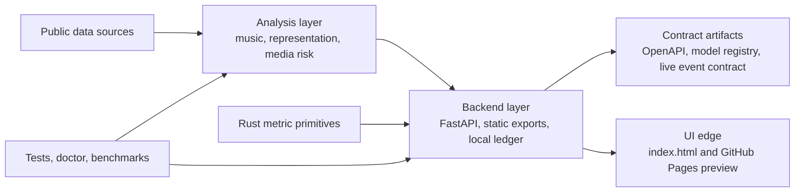

# Stream

<p align="center">
  <strong>LOOPCHii Stream</strong> is an open-source repository for inspectable media analysis, public music intelligence, and reproducible analytical systems.
</p>

<p align="center">
  It separates modeled representation work from public music data on purpose, so readers can always tell what kind of evidence they are looking at and what the claim can actually support.
</p>

<p align="center">
  <a href="https://htmlpreview.github.io/?https://github.com/loopchii/Stream/blob/main/index.html">Launch the dashboard preview</a>
  ·
  <a href="https://htmlpreview.github.io/?https://github.com/loopchii/Stream/blob/main/StreamLen_processors.html">Open the methods notebook</a>
  ·
  <a href="https://github.com/loopchii/Stream/actions/workflows/ci.yml">View CI</a>
</p>

<p align="center">
  
  
  
  
  
</p>

## The 30-Second Read

Stream is a public, self-contained media-analysis repository. It helps people inspect music attention, representation signals, data quality, and lightweight runtime contracts without depending on private LOOPCHii infrastructure.

It is useful today as:

- a reproducible public music analysis engine
- a readable media-representation research surface
- a local FastAPI and static-export playground
- a contribution space for better methods, quality checks, and visual explanation
- a careful prototype for event-contract and runtime-readiness work

It is not presented as:

- a production Kafka, Flink, or Spark replacement
- a hosted compliance platform
- a complete enterprise runtime
- a disclosure of private LOOPCHii architecture

That boundary matters. Stream should earn adoption by being easy to run, easy to inspect, and honest about what the current code can prove.

## First Run

```bash
python3 -m venv venv
source venv/bin/activate
pip install -r requirements-dev.txt
python3 run_analysis.py --output-dir exports
```

This writes a public music report, quality report, song table, and notation-aware music index into `exports/`. It requires no API key.

For the full setup path, read [docs/QUICKSTART.md](docs/QUICKSTART.md). For the production boundary, read [docs/PRODUCTION_READINESS.md](docs/PRODUCTION_READINESS.md).

## Architecture At A Glance



The repository is intentionally readable before it is ambitious. The public
code separates analysis, backend contracts, compiled metric primitives, static
exports, and the browser surface. See [docs/REPOSITORY_STRUCTURE.md](docs/REPOSITORY_STRUCTURE.md)
for the file map.

## What Runs Today

| Surface | Command or route | What it proves |
|---|---|---|
| Public music export | `python3 run_analysis.py --output-dir exports` | Public data can be cleaned, measured, and exported without a private service |
| Environment doctor | `python3 -m stream_backend.cli.doctor` | Required files, imports, static artifacts, SQLite, and data quality are checkable |
| API contract index | `/api/system/api-contracts` | Swagger/OpenAPI routes, schemas, and write surfaces are inspectable |
| Model registry | `/api/system/model-registry` | Trained models, statistical methods, deterministic probes, and claim boundaries are named |
| Live event invariants | `/api/runtime/invariants/live` | Rolling event windows pass through deterministic review checks |
| Static build | `python3 build_static.py` | GitHub Pages artifacts come from the same backend path as the API |
| Rust metric lane | `cargo test --manifest-path loopchii-wasm-core/Cargo.toml` | Compiled entropy, concentration, weighted mean, and chi-square primitives are tested |

## Use The Right Entry Point

The easiest way to understand Stream is to choose the lane that matches your question:

- `Representation`: who appears, who stays central, and where narrowness keeps repeating.
- `Governed response`: what gets interrupted, what gets routed away, and what still requires a human decision.
- `Public music`: how attention, concentration, virality, and market exposure behave on public-source rows.

Pick the first question you want answered, then take the route that matches it:

| If you want to... | Go here | What you get |
|---|---|---|
| Run the public-data path first | `python3 run_analysis.py --output-dir exports` | Reproducible public music artifacts with no API key |
| See the browser surface first | [Dashboard Preview](https://htmlpreview.github.io/?https://github.com/loopchii/Stream/blob/main/index.html) | The public UI with charts, story flow, the real-data music lane, and the clickable audit layer |
| Read the processing choices first | [`StreamLen_processors.html`](https://htmlpreview.github.io/?https://github.com/loopchii/Stream/blob/main/StreamLen_processors.html) | A notebook-style walkthrough of how the data is cleaned, shaped, and measured |
| Inspect the public governance boundary | `/api/system/governance` or the Learn tab | Fairness posture, discrimination pressure, public-data boundary, and the point where a human still has to decide |
| Check the legal and data-use boundary | [docs/PRIVACY_AND_DATA.md](docs/PRIVACY_AND_DATA.md) | What data the repo uses, what it does not collect, and how attribution and privacy posture are handled |
| Try the smallest working tool | `python lens_visualizer.py` | A terminal-first demo with public lens findings and instant visual feedback |
| Check whether your machine is ready | `python -m stream_backend.cli.doctor` | A quick preflight for Python, imports, SQLite, static artifacts, and public music data health |
| Materialize a fresh backend state | `python -m stream_backend.cli.materialize --json` or `make materialize` | Refresh the public runtime, persist the local ledger, and inspect the resulting run id and artifact count |
| See what is usable right now | `/api/system/readiness` | A backend-generated summary of local readiness, current proof points, and bounded commercial fit |
| Verify persisted run history | `/api/system/runtime/ledger` | A readable view of recent materializations, hash-linked persistence, and whether the local chain still verifies |
| Read the current event window | `/api/runtime/metrics/live` | A rolling market surface built from weighted exposure, recommendation, and listener-response events |
| Inspect the event ingress contract | `/api/runtime/events/contract` | Batch bounds, retention posture, filterable fields, and a safe example payload for the live event lane |
| Ingest or seed live events locally | `POST /api/runtime/events` or `POST /api/runtime/events/demo-seed` | A replayable local event window for pressure metrics, contribution experiments, optional bus publishing, and runtime inspection |
| Review one prompt-plus-draft pair | `/api/runtime/review/demo` or `POST /api/runtime/review` | A real guard lane that inspects both the request and the drafted output before it is treated as final text |
| Check whether a small output window is drifting | `/api/runtime/drift/demo` or `POST /api/runtime/drift` | A lightweight text-path drift probe for repetition, leakage, and unstable refusal behavior |
| Translate media risk into review posture | `/api/media-lab/insurability` | A bounded bridge from recommendation/buffer signals into review priority and operational exposure |
| Inspect the score-aware music lane | `/api/music/theory` | A note, chord, tempo, and coverage surface that stays honest about where linked notation exists and where it does not |
| Read the streaming boundary | [docs/STREAMING_FOUNDATION_REVIEW.md](docs/STREAMING_FOUNDATION_REVIEW.md) or `/api/system/streaming-readiness` | A direct read on what is already operational, what remains local, and what would need to change before this could support heavier streaming workloads |
| Benchmark the current public workload | `python benchmarks/analytics_scale.py --rows 1000000` | A reproducible scale baseline for the actual groupby-heavy workload this repo runs today |
| Review the setup and contribution lanes | [contributing.md](contributing.md) | Local setup, accepted scopes, and how to add public value without overclaiming |
| See which environments are expected to work | [docs/SUPPORT_MATRIX.md](docs/SUPPORT_MATRIX.md) | Supported operating systems, Python versions, runtime lanes, and common recovery moves |
| Choose an adoption path | [docs/ADOPTION_PATHS.md](docs/ADOPTION_PATHS.md) | Separate routes for researchers, engineers, and production evaluators |
| Inspect API contracts | [docs/API_CONTRACTS.md](docs/API_CONTRACTS.md) or `/api/system/api-contracts` | Swagger/OpenAPI, write-surface policy, and static contract artifacts |
| Inspect executable models | [docs/MODEL_REGISTRY.md](docs/MODEL_REGISTRY.md) or `/api/system/model-registry` | What is trained, what is statistical, what is deterministic, and what is not claimed |
| Understand repo structure | [docs/REPOSITORY_STRUCTURE.md](docs/REPOSITORY_STRUCTURE.md) | How analysis, backend, compiled metrics, frontend, and verification are separated |
| Read the production boundary | [docs/PRODUCTION_READINESS.md](docs/PRODUCTION_READINESS.md) | What works today, what is not claimed, and what would be needed for production streaming |
| See the roadmap | [ROADMAP.md](ROADMAP.md) | Current capability kept separate from future work |
| Start with the public scope | [What This Actually Does](#what-this-actually-does) | The quickest way to understand what this repo is for, what it is not, and how the evidence is scoped |

If you only have five minutes, do these three things:

1. Run `python3 run_analysis.py --output-dir exports`
2. Run `python3 -m stream_backend.cli.doctor`
3. Read [Questions This Repo Answers Early](#questions-this-repo-answers-early)

## Table Of Contents

- [The 30-Second Read](#the-30-second-read)
- [First Run](#first-run)
- [Architecture At A Glance](#architecture-at-a-glance)
- [What Runs Today](#what-runs-today)
- [Use The Right Entry Point](#use-the-right-entry-point)
- [What This Actually Does](#what-this-actually-does)
- [Browser Playground](#browser-playground)
- [Public Lens SDK](#public-lens-sdk)
- [Media Liability Lab](#media-liability-lab)
- [How To Inspect The Work](#how-to-inspect-the-work)
- [Engineering Depth At A Glance](#engineering-depth-at-a-glance)
- [Streaming Readiness](#streaming-readiness)
- [Preflight](#preflight)
- [Music Virality Module — Real YouTube Data](#music-virality-module--real-youtube-data)
- [Quick Start](#quick-start)
- [Adoption Paths](docs/ADOPTION_PATHS.md)
- [API Contracts](docs/API_CONTRACTS.md)
- [Model Registry](docs/MODEL_REGISTRY.md)
- [Repository Structure](docs/REPOSITORY_STRUCTURE.md)
- [Production Readiness](docs/PRODUCTION_READINESS.md)
- [Roadmap](ROADMAP.md)
- [What the Pipeline Surfaces](#what-the-pipeline-surfaces)
- [The Interactive Dashboard](#the-interactive-dashboard)
- [Project Structure](#project-structure)
- [Data and Methods](#data-and-methods)
- [Public Data, Ethics, and Governance](#public-data-ethics-and-governance)
- [Contributing](#contributing)
- [License and Citation](#license-and-citation)

## How To Inspect The Work

No public repository should ask for faith. It should give you a clean way to inspect the evidence, disagree with the method, and improve the thin spots.

- The analytical scope is explicit. Synthetic representation data is labeled throughout, and the real-data music lane is kept separate on purpose.
- The artifacts are inspectable. The dashboard, methods notebook, static exports, and API surfaces all trace back to code in this repository.
- The same pipeline feeds local runs, static JSON exports, and API responses. That keeps the public story closer to the code that produced it.
- The governance boundary is explicit. `/api/system/governance` and the Learn tab show where fairness signals are strong, where GDPR or consent claims would overreach, and where a person still needs to stay in the loop.
- CI runs tests on push so contributors can change the repo without turning it into a gallery of uncheckable screenshots.

## Engineering Depth At A Glance

This repo is strongest when it leads with the engineering facts:

- `stream_backend/` is the shared backend spine for the live API, static exports, runtime snapshots, and browser-facing state.
- `python -m stream_backend.cli.doctor` checks Python, imports, required files, SQLite writability, static artifacts, genre coverage, year coverage, and decision-lab generation before you rely on a local run.
- `python -m stream_backend.cli.materialize --json` is now a real entrypoint. It refreshes the runtime outputs and can persist a fresh local ledger record in one step.
- `POST /api/runtime/events`, `GET /api/runtime/events/contract`, and `GET /api/runtime/metrics/live` give the repo a bounded event-ingestion surface with explicit filters, retention rules, and replayable inspection.
- `/ws/runtime/metrics/live` exposes the same rolling window over a WebSocket feed so the presentation tier can subscribe instead of rebuilding the math in the browser.
- `stream_backend/services/enterprise_bus.py` can publish event batches and metric receipts to Redpanda and ClickHouse when those sinks are wired into the environment.
- `loopchii-wasm-core/` now carries a compiled metric lane with tested entropy, concentration, weighted mean, and chi-square primitives.
- `benchmarks/analytics_scale.py` benchmarks the real public workload instead of a toy micro-example.
- `build_static.py` regenerates the same contracts the browser reads when no live API is present.
- `data/system/*.json` exposes machine-readable operating contracts, runtime posture, critical-spine notes, data-engineering metadata, and streaming-readiness limits.
- State-changing endpoints can stay open for local use or require `X-API-Key` when `STREAM_API_KEY` is set in the environment.
- Persisted runtime rows are hash-linked so contributors can verify run order and spot silent replacement more easily.
- The statistical layer is not decorative. The repo uses chi-square tests, Shannon entropy, NetworkX assortativity, Cramer's V, bootstrap confidence intervals, cross-validated RandomForest and GradientBoosting models, and counterfactual decision-lab experiments.
- Validation is part of the operating path: `pytest -q` covers pipeline logic, API behavior, music analysis, live runtime windows, decision routing, and runtime checks.

If you want the full topology and current operational posture in one place, read [docs/ENGINEERING_FOUNDATION.md](docs/ENGINEERING_FOUNDATION.md).

## Streaming Readiness

This repo now exposes a direct self-audit for streaming and data-infrastructure readers.

- `docs/STREAMING_FOUNDATION_REVIEW.md` is the written review.
- `/api/system/streaming-readiness` is the machine-readable surface.
- `benchmarks/analytics_scale.py` is the first scale benchmark for the public workload.

The point is not to borrow language the backend has not earned. The point is to make the current boundary explicit, measurable, and improvable.

## Preflight

Before you decide whether the repo is useful, there are three fast checks:

```bash
python -m venv venv
source venv/bin/activate
pip install -r requirements-dev.txt
python -m stream_backend.cli.doctor
```

That doctor is here for a reason. Good public repos answer the first skeptical questions early:

- Does the environment actually work on this machine?
- Are the required analysis packages present, including `scipy`?
- Is the public music corpus healthy enough to support the timeline and comparison surfaces?
- Are the static artifacts fresh, or am I looking at an out-of-date build?

If you want the platform details behind those checks, see [docs/SUPPORT_MATRIX.md](docs/SUPPORT_MATRIX.md).

Cross-platform commands for macOS, Linux, Windows PowerShell, and Docker are documented in [docs/SUPPORT_MATRIX.md](docs/SUPPORT_MATRIX.md) so the first install path does not depend on guesswork.

## Data Engineering Surface

Stream now exposes its public analytical operating model directly instead of hiding it behind screenshots and prose. The Learn tab and `/api/system/data-engineering` surface show the same things a data engineer or analytics lead would ask for before relying on a public number:

- dataset grain and primary keys
- partition strategy and refresh posture
- quality checks on nulls, uniqueness, domain control, and leakage
- bronze → silver → gold → serving lineage
- delivery parity across FastAPI, static JSON exports, and the browser surface
- deterministic synthetic seed, public artifact contract, and self-contained runtime boundary

This is deliberate. A chart should not be the first place someone learns how a system behaves. The pipeline, the contract boundary, and the publishing discipline should be visible before anyone is asked to carry the result forward.

The repo now also exposes a separate public governance contract. That surface is intentionally practical: it spells out where discrimination pressure is still material, where the repo remains a public-scope research tool rather than a consent-management system, and when a conclusion is still too soft to automate.

## Questions This Repo Answers Early

Senior engineers, researchers, and media operators usually ask some version of the same things:

- **How much of this is real data?**  
  The streaming-media representation lane is synthetic and labeled as such. The music virality lane is built from committed public datasets and kept separate on purpose.

- **Is the story just written into the front end?**  
  No. The browser surface reads baked JSON or the live API, both generated by the same Python pipeline. The new decision lab and runtime doctor come from that same backend path.

- **What happens when the evidence is thin?**  
  The coverage posture is surfaced directly in the quality, timeline, and decision-lab outputs. Missing publication years and unlabeled fields stay visible instead of being smoothed away.

- **Can I inspect the contract before I repeat the charts?**
  Yes. `data/system/*.json`, `openapi.stream.json`, `/docs`, and the Learn tab all exist for that reason.

- **Does this depend on a private LOOPCHii platform to work?**  
  No. This repository ships its own public Python pipeline, static exports, SQLite materialization, browser surface, and API. It is intentionally self-contained.

- **How do I know a weak conclusion is being treated as weak?**  
  Coverage, evidence posture, missing publication years, labeled-share gaps, and cohort split notes are surfaced directly in the music lane and the decision lab. Stream is more useful when it says “not enough here yet” than when it smooths uncertainty away.

## Backend Runtime Spine

The repo is no longer just a front-end shell with a Python API bolted on. The public interface now runs through a package-based backend spine in `stream_backend/` that does four jobs:

- computes role-aware analytical state for the browser instead of leaving those numbers trapped in `index.html`
- materializes a repeatable public runtime snapshot into `data/system/*.json`
- persists run metadata and artifacts into a local SQLite database for replay and inspection
- keeps the live API, static build, and exported research artifacts aligned from the same code path

Recent additions make that spine easier to verify:

- `data/system/critical-spine.json` explains what each major visual is for, what could weaken its conclusion, and how to improve the analysis
- `openapi.stream.json` mirrors the live FastAPI schema for contributors who want an offline contract
- `manifest.webmanifest` and `service-worker.js` keep the static surface usable as a lightweight offline shell
- `Dockerfile` bakes the static exports first, then serves the live API from the same repository state

The result is intentionally polyglot: Python drives the analysis and orchestration, JavaScript renders the public browser surface, and the repo's existing Rust/WASM lane remains available for lighter-weight public demos. The public value is in the connective tissue between those layers, not in any one language by itself.

## Choose Your Path

| Reader | Best first stop | Why |
|---|---|---|
| Engineer | [Quick Start](#quick-start) | Run it locally, inspect the API, and trace outputs back to code |
| Researcher | [Data and Methods](#data-and-methods) | Review assumptions, metrics, and the synthetic-vs-real boundary before citing anything |
| Designer or writer | [The Interactive Dashboard](#the-interactive-dashboard) | See how the visual flow, narrative pacing, and explanation strategy are structured |
| Contributor | [contributing.md](contributing.md) | Find the accepted lanes for code, data, docs, and public research support |

<div align="center">
  


</div>

## What This Actually Does

Stream models representation across streaming media from 2015 to 2026. Instead of stopping at demographic counts, it computes measurable signals: dialogue distribution, character-network clustering, role typecasting, screen-time and sentiment gaps, intersectional representation ratios, platform-by-media differences, and temporal drift.

**Honesty note:** the base entertainment dataset is synthetic — generated with a fixed random seed (`np.random.seed(42)`) and shaped to mirror patterns reported in media-representation research. It is good for learning, testing, and explaining the methods. It is not a claim about real catalogues or real studios.

The interactive dashboard lets you inspect those patterns across seven tabs — Dashboard, Explore Data, Insights, Bias Library, Learn, Verdict, and **Music Virality** — with filtering by platform, genre, media type, and year. The music tab now adds role lenses for artists, consumers, business teams, and researchers so the same evidence can be framed for different readers without changing the underlying numbers.

## What This Repo Is Not

- It is not a hidden proprietary LOOPCHii runtime.
- It is not a claim about private studio catalogues, internal platform data, or undisclosed production systems.
- It is not a generic “AI for media” wrapper. The value here is in clear methods, disciplined interpretation, and visible public artifacts.

## Browser Playground

The fastest path into Stream is now the public split-screen playground in [`index.html`](https://htmlpreview.github.io/?https://github.com/loopchii/Stream/blob/main/index.html). It exists for one reason: most public research repos make people read for ten minutes before they can feel any value. This one should not.

What it gives you immediately:

- a browser-side comparison between a typical wrapper that reacts after risky material renders and a governed path that stops the fragment before it lands
- a tiny public wrapper surface in [`packages/loopchii-lite`](packages/loopchii-lite) for contributors who want something they can inspect and adapt in minutes
- a deterministic set of nuisance cases that map to ordinary engineering headaches: direct identifiers, leaked secrets, protected text, and unsafe retention prompts

The playground is intentionally public. It does **not** claim private runtime enforcement, hardware binding, or proprietary LOOPCHii internals. Its job is adoption: prove usefulness quickly, invite contribution honestly, and give engineers something concrete to extend.

Minimal public example:

```js
import { govern } from "@loopchii/loopchii-lite";

const result = govern({
  prompt: "Draft a reply using the customer email export and phone numbers.",
  draftResponse: "Here are the contacts: jordan@example.com ..."
});

return result.allowed ? result.standardResponse : result.safeResponse;
```

## Public Lens SDK

`Stream` now exposes a small public extension surface for contributors who want something more active than a static dashboard:

- `lens_sdk.py` provides a minimal `KineticLens` protocol plus grouped `StreamRecord` inputs and typed `GeometricMask` findings.
- `lens_visualizer.py` gives a terminal-first demo path so contributors can run a live grouped stream and watch findings surface immediately.
- `/api/lenses/catalog` publishes the active public lenses.
- `/api/lenses/demo-stream` evaluates the cached grouped stream through the same public registry.

This is intentionally scoped. It gives contributors a truthful place to add assessors, heuristics, and public reasoning layers without opening private LOOPCHii architecture.

## Media Liability Lab

The repo now includes a public research harness for media-platform risk questions:

- **Compulsive loop analysis** via `media_liability_lab.py`, which scores how repetitive and sticky a recommendation stream looks.
- **Generative guard simulation**, which screens an output buffer against public signatures and zeroizes it when a match is detected.
- **Causal map export**, which turns a recommendation sequence into nodes, edges, and repeat-path risk markers.

The public API exposes this through:

- `/api/media-lab/overview`
- `/api/media-lab/compulsive-loop`
- `/api/media-lab/generative-guard`
- `/api/media-lab/causal-map`

This is a public research harness, not a claim that the repo contains private production enforcement. Its value is that contributors can test the logic, extend the heuristics, and inspect the outputs directly.

<div align="center">
  


</div>

## Music Virality Module — Public Music Data

The music lane is separate from the synthetic representation lane. It analyzes a primary **Top 100 YouTube music cohort** and an enriched public context of **636 songs** across committed source files, with 10.59 billion views in the core cohort.

| Analysis | What It Computes | Where to See It |
|---|---|---|
| **Power-law fit** | MLE exponent α with bootstrap 95% CI + KS distance (Clauset method) | Movement 01 — log-log CCDF scatter |
| **Inequality** | Gini coefficient, Lorenz curve, Theil entropy, top-k channel concentration | Movement 02 — Lorenz curve + channel bar |
| **Correlation architecture** | Spearman ρ + partial correlations controlling for channel size, with bootstrap CIs | Movement 03 — heatmap + ranked bar chart (toggle raw/partial) |
| **Viral archetypes** | K-means (k=5) on log-views, virality, channel size, duration → named strategies | Movement 04 — scatter coloured by cluster |
| **Tag co-occurrence network** | NetworkX graph of shared tags, greedy-modularity communities, density | Movement 05 — D3 force-directed graph |
| **Predictability** | RandomForest + GradientBoosting ensemble, 5-fold cross-validated R² | Movement 06 — skill-vs-luck gauge + importances |
| **Release scenario lab** | Trained model maps hypothetical (duration, subscribers, tags, official) → percentile | Movement 09 — slider controls + grade gauge |
| **Repeat pressure map** | Public proxy for repetition, release pressure, and attention oscillation across the real music catalog | Movement 07 — 3D resonance core + clickable track list |
| **Bias analysis** | Gender parity, genre concentration (Gini), collaboration patterns, duration bias, attention concentration, per-genre breakdowns, and a publication timeline drawn from public upload dates | Movement 09 — equity grade + 7 charts + genre table |
| **3D virality landscape** | Plotly 3D scatter of views × virality × subscribers, coloured by archetype cluster | Movement 10 — interactive 3D orbit |
| **Real songs explorer** | Sortable, searchable table with computed public features | Movement 11 — sortable table |

**Live data extraction (optional):** If you set a `YOUTUBE_API_KEY` environment variable, the built-in `music_ingest.py` module calls the YouTube Data API v3 to refresh view counts and pull additional tracks on demand — no code changes needed. Without a key, the app serves the committed real dataset.

Data sources: YouTube Top 100 (2025), Most Viewed Music Videos (2026, Kaggle), YouTube Music Data (Kaggle), YouTube Top Channels (2026, Kaggle). The music lane uses public rows and keeps source coverage, genre coverage, year coverage, and missing notation visible.

### Score-Aware Music Intelligence

The repo now includes a separate harvest layer for score and notation work:

- `music_intelligence.py` scans the repository for MusicXML, MIDI, ABC, LilyPond, tabs, and chord charts.
- `music_index.json` and `music_index.csv` export the piece-level index.
- `music_analysis_report.md` summarizes what is actually linked today.

This layer keeps the scope strict:

- the public song catalog and the score layer are separate on purpose
- note and chord claims appear only when the repository contains notation-bearing files
- when the repo has no linked score material, the surface shows the gap instead of faking musical certainty

That means contributors can deepen the music lane in a very concrete way: add notation files under `scores/`, `music/`, `notation/`, or similar public folders and rerun the build. The UI will fold those files back into the song index automatically and start surfacing note families, chord movement, key distribution, and the score-link coverage rate.

## The Mathematical Framework

<table>
<tr style="background-color:#FFE4E1;">
<td><strong>Component</strong></td>
<td><strong>What It Means</strong></td>
<td><strong>Why I Chose It</strong></td>
</tr>
<tr>
<td><strong>Dialogue Bias</strong></td>
<td>Chi-square test on word counts by group</td>
<td>Tests whether dialogue is distributed evenly across demographics, with a p-value</td>
</tr>
<tr style="background-color:#F0F8FF;">
<td><strong>Diversity Index</strong></td>
<td>Shannon entropy across demographics</td>
<td>Information theory perfectly captures "variety" in mathematical terms</td>
</tr>
<tr>
<td><strong>Gender Parity</strong></td>
<td>1 - |0.5 - female_ratio| × 2</td>
<td>Simple but effective: 1.0 means perfect parity, 0 means complete imbalance</td>
</tr>
<tr style="background-color:#FFF0F5;">
<td><strong>Intersectionality Score</strong></td>
<td>Group share vs a uniform 1/45 baseline (3 genders × 5 races × 3 age bands)</td>
<td>Captures compound effects when multiple identities intersect</td>
</tr>
<tr>
<td><strong>Network Homophily</strong></td>
<td>NetworkX attribute assortativity coefficient</td>
<td>Reveals whether characters interact mostly with similar demographics</td>
</tr>
</table>

<div align="center">
  


</div>

## Analysis Pipeline (What Actually Runs)

<details>
<summary><strong>The methods implemented in <code>streamlens_processor.py</code>:</strong></summary>

<table>
<tr style="background-color:#E6E6FA;">
<td><strong>Method</strong></td>
<td><strong>Where</strong></td>
<td><strong>What It Computes</strong></td>
</tr>
<tr>
<td><strong>Shannon Entropy</strong></td>
<td><code>calculate_diversity_index</code></td>
<td>Normalized diversity index over demographic distributions</td>
</tr>
<tr style="background-color:#FFE4E1;">
<td><strong>Chi-Square Test</strong></td>
<td><code>detect_dialogue_bias</code></td>
<td>Whether dialogue word counts deviate from an even split (gender and race)</td>
</tr>
<tr>
<td><strong>Intersectionality Ratios</strong></td>
<td><code>calculate_intersectionality_score</code></td>
<td>Each gender×race×age group's share vs a uniform baseline</td>
</tr>
<tr style="background-color:#F0F8FF;">
<td><strong>Network Analysis</strong></td>
<td><code>build_character_network</code>, <code>detect_homophily</code></td>
<td>Character interaction graph, centrality, assortativity by demographic</td>
</tr>
<tr>
<td><strong>Role Stereotyping</strong></td>
<td><code>detect_role_stereotyping</code></td>
<td>Over/under-representation of demographics in lead vs supporting roles</td>
</tr>
<tr style="background-color:#FAFAD2;">
<td><strong>Bias Dimensions</strong></td>
<td><code>process_data</code></td>
<td>Age, sentiment, and screen-time bias as group deviations from overall means</td>
</tr>
</table>

No machine-learning models are trained in this pipeline — every number is a transparent statistical computation you can step through in the source.

</details>

<div align="center">
  


</div>

## Quick Start

```bash
git clone https://github.com/loopchii/Stream.git
cd Stream

python -m venv venv
source venv/bin/activate

pip install -r requirements-dev.txt
python3 run_analysis.py --output-dir exports
python3 -m stream_backend.cli.doctor
```

That is the first adoption path. It proves the committed public music data can
load, clean, measure, and export without a private service or API key.

Useful next commands:

```bash
# Launch the API server and dashboard.
python3 app.py

# Refresh static artifacts for the browser preview.
python3 build_static.py

# Refresh the runtime and ledger directly.
python3 -m stream_backend.cli.materialize --json

# Run the local validation path.
make doctor
make test
```

If you prefer a container path, copy `.env.example` to `.env` if needed and run:

```bash
docker compose up --build
```

### API Endpoints

| Endpoint | Method | Description |
|---|---|---|
| `/` | GET | Interactive dashboard |
| `/api/health` | GET | Health check |
| `/api/results` | GET | Full cached analysis results |
| `/api/analyze?n_samples=N` | POST | Re-run the analysis pipeline |
| `/api/metrics/overview` | GET | Diversity index + gender parity |
| `/api/metrics/temporal` | GET | Year-over-year metrics |
| `/api/metrics/platforms` | GET | Per-platform comparison |
| `/api/metrics/bias` | GET | Bias detection: dialogue, age, racial dialogue, sentiment, screen time |
| `/api/metrics/genres` | GET | Per-genre diversity, parity, lead share, dialogue gap |
| `/api/metrics/media` | GET | Per-media-type (series, film, docuseries, animation…) metrics |
| `/api/metrics/platform-media` | GET | Per-platform media-type breakdown (format-specific analysis) |
| `/api/metrics/network` | GET | Interaction network homophily and density |
| `/api/metrics/intersectionality` | GET | Most under/over-represented intersectional groups |
| `/api/insights` | GET | Narrative findings generated from the data |
| `/api/lenses/catalog` | GET | Public catalog of the active lens registry |
| `/api/lenses/demo-stream` | GET | Grouped stream records evaluated by the public lens SDK |
| `/api/media-lab/overview` | GET | Combined public snapshot of recommendation, guard, and causal-map research outputs |
| `/api/media-lab/compulsive-loop` | GET | Compulsive-loop risk score and recommended friction for a sample recommendation stream |
| `/api/media-lab/generative-guard` | GET | Public generative buffer screening and zeroization demo |
| `/api/media-lab/causal-map` | GET | Topological recommendation-flow export with repeat-path risk edges |
| `/api/media-lab/insurability` | GET / POST | Bounded liability translation for recommendation + generated-media signals, with optional custom review payload |
| `/api/system/catalog` | GET | Public catalog of runtime surfaces, generated assets, and active analytical lanes |
| `/api/system/readiness` | GET | Backend-generated summary of what works now, current proof points, and honest commercial boundaries |
| `/api/system/integrations` | GET | Current integration paths, adoption lanes, and the boundary between usable now versus still-to-build |
| `/api/system/runtime` | GET | Fresh materialized runtime snapshot spanning synthetic, music, and orchestration surfaces |
| `/api/system/runtime/latest` | GET | Latest persisted runtime snapshot from the local SQLite-backed run history |
| `/api/system/runtime/ledger` | GET | Readable verification surface for recent runtime materializations and their hash-linked chain |
| `/api/system/frontend-state` | GET | Browser-ready payload generated by the backend instead of hand-authored view math |
| `/api/system/critical-spine` | GET | Per-visual purpose, limits, and improvement guidance generated from the backend runtime |
| `/api/system/comparatives` | GET | Comparative framing surface for role-aware reading across the same evidence |
| `/api/system/materialize` | POST | Force a runtime materialization pass and write updated public artifacts |
| `/api/runtime/review/demo` | GET | Sample prompt-plus-draft review showing what the guard does before text is treated as acceptable output |
| `/api/runtime/review` | POST | Review a real prompt and drafted response together |
| `/api/runtime/drift/demo` | GET | Sample text-window drift surface |
| `/api/runtime/drift` | POST | Review a custom output window for leakage, repetition, and refusal inconsistency |
| `/api/metrics/advanced` | GET | Inequality (Gini/Theil/Lorenz), Simpson/Theil diversity, Cramér's V effect sizes, bootstrap CIs, fitted year trend |
| `/api/metrics/scorecard` | GET | Per-platform A–F report card across four representation dimensions |
| `/api/simulate/parity?female_ratio=R` | GET | What-If parity index, letter grade, and verdict for a hypothetical female lead share |
| `/api/learn` | GET | Educational explanations of every metric |
| `/api/bias-library` | GET | 50+ documented bias types, filterable by `?category=` |
| `/api/export` | GET | Download full results as JSON |
| `/api/characters` | GET | Filterable character records (`platform`, `genre`, `year`, `limit`) |
| `/api/music/overview` | GET | Headline stats: songs, channels, total views |
| `/api/music/powerlaw` | GET | Power-law fit: α, KS distance, bootstrap CI, CCDF |
| `/api/music/inequality` | GET | Gini, Lorenz, Theil, top-k channel concentration |
| `/api/music/correlations` | GET | Spearman + partial correlations with bootstrap CIs |
| `/api/music/archetypes` | GET | K-means viral archetype clusters + scatter |
| `/api/music/network` | GET | Tag co-occurrence graph (nodes, edges, communities) |
| `/api/music/predictability` | GET | Cross-validated ensemble R² and feature importances |
| `/api/music/songs` | GET | Real songs table (sortable, `?limit=` `?sort_by=`) |
| `/api/music/simulate` | GET | What-If virality predictor (`?duration_min=` `?channel_follower_count=` `?tag_count=`) |
| `/api/music/bias` | GET | Gender, genre, collaboration, duration, and concentration bias metrics |
| `/api/music/genres` | GET | Per-genre breakdown with view share, duration, collaboration mix, and top track |
| `/api/music/timeline` | GET | Publication timeline built from public upload dates and views |
| `/api/music/theory` | GET | Score-aware note, chord, tempo, and coverage surface built from linked notation assets |
| `/api/music/status` | GET | Whether a YouTube API key is configured for live data |
| `/api/music/refresh` | POST | Pull fresh data from YouTube Data API v3 (needs key) |

Interactive API docs are available at `http://localhost:8000/docs`.

When `STREAM_API_KEY` is set, state-changing endpoints require `X-API-Key`. If it is unset, the repo stays friction-light for local research and contribution.

<div align="center">
  


</div>

## What the Pipeline Surfaces

Findings are generated live from the current dataset by `/api/insights` — they are computed, not pre-written. On the default seeded dataset the pipeline surfaces patterns like:

<table>
<tr style="background-color:#FFE4E1;">
<td><strong>Signal</strong></td>
<td><strong>How It's Measured</strong></td>
<td><strong>Where to See It</strong></td>
</tr>
<tr>
<td><strong>Gender lead gap</strong></td>
<td>Lead-role share by gender, per genre and platform</td>
<td>Dashboard bubble chart, Insights tab</td>
</tr>
<tr style="background-color:#F0F8FF;">
<td><strong>Dialogue gap</strong></td>
<td>Chi-square on dialogue word counts by gender and race</td>
<td>Insights → Bias Breakdown</td>
</tr>
<tr>
<td><strong>Age representation</strong></td>
<td>Share of 50+ characters and their dialogue deviation</td>
<td>Insights tab, time series</td>
</tr>
<tr style="background-color:#FFF0F5;">
<td><strong>Intersectional gaps</strong></td>
<td>Gender×race×age group shares vs uniform baseline</td>
<td>Insights → Intersectionality table</td>
</tr>
<tr>
<td><strong>Network homophily</strong></td>
<td>Assortativity of the character interaction graph</td>
<td>Dashboard network graph</td>
</tr>
<tr style="background-color:#FAFAD2;">
<td><strong>Temporal trends</strong></td>
<td>Year-over-year diversity and parity, 2015–2026</td>
<td>Year slider with era readouts, time series</td>
</tr>
</table>

Because the data is synthetic, treat the exact values as demonstrations of the method — not real-world measurements.

<div align="center">
  


</div>

## The Interactive Dashboard

<details>
<summary><strong>Five screens with a story arc (Act I–V), plus the core visualizations:</strong></summary>

### The Screens
- **Dashboard (Act I)** — live stat cards, year slider with era readouts, bubble chart, 3D representation landscape, network graph, time series, radar chart
- **Explore Data (Act II)** — the raw character-level records behind every metric, filterable by platform, genre, media type, and year; media-mix donut
- **Insights (Act III)** — findings generated by the pipeline, plus the bias breakdown and intersectionality tables
- **Bias Library (Act IV)** — 57 documented bias types across 8 categories, searchable, with the ones Stream quantifies marked
- **Learn (Act V)** — plain-language explanations of every metric, with pointers into the source code
- **Verdict (Act VI)** — a platform A–F report card, a Lorenz/Gini inequality curve, Cramér's V effect-size bars, a fitted decade trend line, and a What-If parity simulator wired to the backend
- **Music Virality (Real Data)** — eight-movement deep dive into 100 real YouTube music videos: power-law, inequality, correlations, archetypes, tag network, predictability, What-If predictor, and a sortable real-songs explorer

### Bubble Chart: The Big Picture
Each bubble is a platform-genre combination with its own color. I spent way too long on the color system, but now you can instantly see patterns:
- Netflix (red family): Comedy is light red, Action is dark red
- HBO Max (purple family): Same gradient system
- Position shows female lead percentage (x-axis) and diversity index (y-axis)
- Size indicates overall equality score

### Network Graph: Who Talks to Whom
This one surprised me. Characters cluster by demographics even within the same show. Drag the nodes around and watch how they're connected. The clustering is so strong it's actually depressing.

### Time Series: Are Things Getting Better?
Four metrics tracked across 2015–2026. In the synthetic dataset, gender parity and diversity improve gradually year over year — mirroring the slow-progress pattern reported in representation research.

### Radar Chart: Character Archetypes
Shows which demographics get which roles. Men dominate protagonists and antagonists, women are overrepresented as romantic interests, non-binary characters barely register. The pattern is consistent across all platforms.

</details>

<div align="center">
  


</div>

## How to Use This for Your Own Analysis

```python
from streamlens_processor import DataProcessor

processor = DataProcessor()

# Generate the seeded synthetic dataset (or substitute your own DataFrame
# with the same columns: platform, genre, media_type, year, gender, race,
# age_group, role_type, screen_time, dialogue_words, sentiment_score)
df = processor.generate_synthetic_data(n_samples=5000)

# Run the full analysis pipeline
results = processor.process_data(df)
print(results['overall_metrics'])          # diversity_index, gender_parity, …
print(results['bias_detection'].keys())    # dialogue, age, sentiment, screen time …

# Human-readable findings
for insight in processor.generate_insights(df, results):
    print(insight['title'], '—', insight['detail'])

# Export everything as JSON (also what the API serves)
processor.export_results(results, filename='analysis_results.json')
```

<div align="center">
  


</div>

## Project Structure

```
Stream/
│
├── index.html                    # The interactive dashboard (start here)
├── app.py                        # FastAPI server (dashboard + REST API)
├── build_static.py               # Static export builder for GitHub Pages / no-server preview
├── lens_sdk.py                   # Public extension protocol for grouped stream assessors
├── lens_visualizer.py            # Terminal-first demo of the public lens registry
├── media_liability_lab.py        # Public media-platform risk research harness
├── streamlens_processor.py       # Main processing pipeline
├── bias_library.py               # 57 documented bias types served at /api/bias-library
├── music_pipeline.py             # Real-data music virality analysis (power-law, Gini, clustering, RF, role lenses)
├── music_ingest.py               # YouTube Data API v3 live extraction (key-optional)
├── stream_backend/               # Package-based runtime spine: analytics, orchestration, export, SQLite store
│   ├── analytics/                # Role lenses, comparative framing, quality surfaces, narrative outputs
│   ├── orchestration/            # Runtime jobs, epochs, asset mapping, materialization flow
│   ├── services/                 # High-level runtime and frontend-state services
│   ├── store/                    # SQLite schema, run history, artifact persistence
│   ├── exporters/                # JSON, markdown, and SQLite export helpers
│   └── cli/                      # Rebuild, validate, and materialize entrypoints
├── data_sources/                 # Real CSV data (youtube-top-100-songs-2025.csv)
├── data/system/                  # Generated public runtime artifacts for the static browser surface
├── StreamLen_processors.ipynb    # Jupyter notebook with full analysis
├── streaming-bias-index.html     # Legacy static dashboard
├── analysis_results.json         # Latest exported analysis results
├── requirements.txt              # Core Python dependencies
├── requirements-full.txt         # Extended research stack
│
├── tests/
│   ├── test_analyzer.py          # Unit tests for the pipeline
│   ├── test_api.py               # API tests
│   ├── test_lens_sdk.py          # Public lens SDK tests
│   ├── test_media_liability_lab.py  # Media-platform research harness tests
│   └── test_music.py             # Music pipeline + API tests
│
└── .github/workflows/ci.yml     # CI: lint + tests on Python 3.11/3.12
```

<div align="center">
  


</div>

## Data and Methods

<table>
<tr style="background-color:#E6E6FA;">
<td><strong>Aspect</strong></td>
<td><strong>What It Is</strong></td>
<td><strong>Why</strong></td>
</tr>
<tr>
<td><strong>Dataset</strong></td>
<td>Synthetic, generated in <code>generate_synthetic_data()</code> with <code>np.random.seed(42)</code></td>
<td>Fully reproducible; every chart can be traced to the generating code</td>
</tr>
<tr style="background-color:#FFE4E1;">
<td><strong>Scope</strong></td>
<td>5,000 characters by default · 6 platforms · 6 genres · 11 media types · 2015–2026</td>
<td>Re-runnable at 1,000–25,000 samples from the dashboard or <code>POST /api/analyze</code></td>
</tr>
<tr>
<td><strong>Shape</strong></td>
<td>Distributions mirror patterns reported in media-representation research, improving gradually by year</td>
<td>Demonstrates the methods on realistic structure without claiming real measurements</td>
</tr>
<tr style="background-color:#F0F8FF;">
<td><strong>Bias Library</strong></td>
<td>57 named bias types with conceptual definitions and examples; no invented statistics</td>
<td>Field knowledge stays truthful — definitions describe documented concepts only</td>
</tr>
</table>

### Statistical Rigor

The synthetic representation lane uses chi-square goodness-of-fit testing for dialogue distribution (with p-values), normalized Shannon entropy for diversity, attribute assortativity for network homophily, and deviation-from-mean comparisons for age, sentiment, and screen-time bias.

The real-data music lane goes further: it includes bootstrap confidence intervals for the power-law tail, partial Spearman checks for feature relationships, a cross-validated ensemble regressor for the what-if predictor, and a public audit surface that shows how rows were filtered, deduplicated, or held back before any chart claims to be meaningful.

<div align="center">
  


</div>

## Why This Matters

Media shapes culture. When most action heroes are male, when women of color rarely hold lead roles, when characters over 50 fade from screens, it sends a message about whose stories matter. This isn't about quotas or political correctness. It's about accurately reflecting the world we live in.

Stream exists to make those patterns measurable and readable at the same time. The Bias Library names documented patterns so you can spot them; the Learn tab explains the math so you can verify it; the Explore tab hands you the raw rows so you never have to take a summary at face value.

## Public Data, Ethics, and Governance

This repository is easier to inspect when its boundaries are easy to find.

Start with these documents:

- [docs/PRIVACY_AND_DATA.md](docs/PRIVACY_AND_DATA.md) for the public-data boundary, attribution posture, privacy scope, and what the repo does not collect
- [docs/ETHICS.md](docs/ETHICS.md) for the human-consequence and uncertainty standards behind the analysis surfaces
- [GOVERNANCE.md](GOVERNANCE.md) for maintainership, claim-boundary rules, and merge discipline
- [TERMS.md](TERMS.md) for repository use terms and third-party source caution
- [NOTICE](NOTICE) for the Apache 2.0 attribution record shipped with the repository
- [data/README.md](data/README.md) for the current input and artifact structure across synthetic, music, and system surfaces
- [CODE_OF_CONDUCT.md](CODE_OF_CONDUCT.md) for contributor behavior expectations

The short version is simple:

- code is Apache 2.0 licensed
- synthetic data stays labeled as synthetic
- public music analysis stays tied to documented public-source inputs
- private LOOPCHii systems stay out of this repository
- uncertainty should remain visible instead of being polished away

<div align="center">
  


</div>

## Contributing

If you want to help make Stream better, the strongest contributions usually improve one of these:

- **Data Collection**: More international content, more platforms
- **Statistical Methods**: Always room for improvement in bias detection
- **Visualization**: Making complex patterns more intuitive
- **Documentation**: Explaining the math in simpler terms

Before opening a pull request, read:

- [contributing.md](contributing.md)
- [CODE_OF_CONDUCT.md](CODE_OF_CONDUCT.md)
- [GOVERNANCE.md](GOVERNANCE.md)
- [docs/PRIVACY_AND_DATA.md](docs/PRIVACY_AND_DATA.md)
- [NOTICE](NOTICE)

The repo also ships issue templates for bugs, feature requests, and data/source improvements so contributors can plug in without guessing the expected shape.

<div align="center">
  


</div>

## Technical Performance

<table>
<tr style="background-color:#FFE4E1;">
<td><strong>Metric</strong></td>
<td><strong>Performance</strong></td>
<td><strong>Notes</strong></td>
</tr>
<tr>
<td><strong>Processing Speed</strong></td>
<td>A few seconds for the default 5,000-sample run</td>
<td>Vectorized pandas operations</td>
</tr>
<tr style="background-color:#F0F8FF;">
<td><strong>Test Coverage</strong></td>
<td>149 pytest tests (pipeline + API + music + decision lab + runtime doctor + public lens SDK + media liability lab)</td>
<td>Run with <code>pytest tests -q</code>; CI on Python 3.11/3.12</td>
</tr>
<tr>
<td><strong>Data Coverage</strong></td>
<td>5,000 synthetic characters by default (1,000–25,000 configurable)</td>
<td>6 platforms × 6 genres × 11 media types</td>
</tr>
<tr style="background-color:#FFF0F5;">
<td><strong>Temporal Range</strong></td>
<td>12 years (2015–2026)</td>
<td>Captures the streaming era through the present</td>
</tr>
<tr>
<td><strong>Visualization Stack</strong></td>
<td>D3.js, Plotly WebGL/3D, Chart.js, Apache ECharts, Three.js</td>
<td>Single-file dashboard, no build step</td>
</tr>
</table>

<div align="center">
  


</div>

## License and Citation

Stream is released under the [Apache License 2.0](LICENSE).

The code is open. The source boundary is still important:

- repository code and documentation are Apache 2.0 licensed
- third-party data sources keep their own licenses or platform terms
- committed public analysis artifacts should stay attributed and clearly scoped

For the legal, privacy, ethics, and governance surfaces, see:

- [docs/PRIVACY_AND_DATA.md](docs/PRIVACY_AND_DATA.md)
- [docs/ETHICS.md](docs/ETHICS.md)
- [GOVERNANCE.md](GOVERNANCE.md)
- [TERMS.md](TERMS.md)
- [NOTICE](NOTICE)
- [data/README.md](data/README.md)

If you use Stream in research:

```bibtex
@software{streamlens2026,
  title = {Stream: LOOPCHii Open Repository for Media Bias and Attention Analysis},
  author = {Aporbo, Cazandra},
  year = {2026},
  url = {https://github.com/loopchii/Stream}
}
```

<div align="center">
  


</div>

## Contact

**Author**: Cazandra Aporbo, MS  
**Repository**: [github.com/loopchii/Stream](https://github.com/loopchii/Stream)  
**Issues**: [Report bugs or request features](https://github.com/loopchii/Stream/issues)

Currently working on expanding this to include international content and historical analysis pre-2015. If you have access to good datasets or want to collaborate, reach out through GitHub issues.

<div align="center">

<br>

Building transparency in media representation through rigorous mathematical analysis.

<br>


</div>
